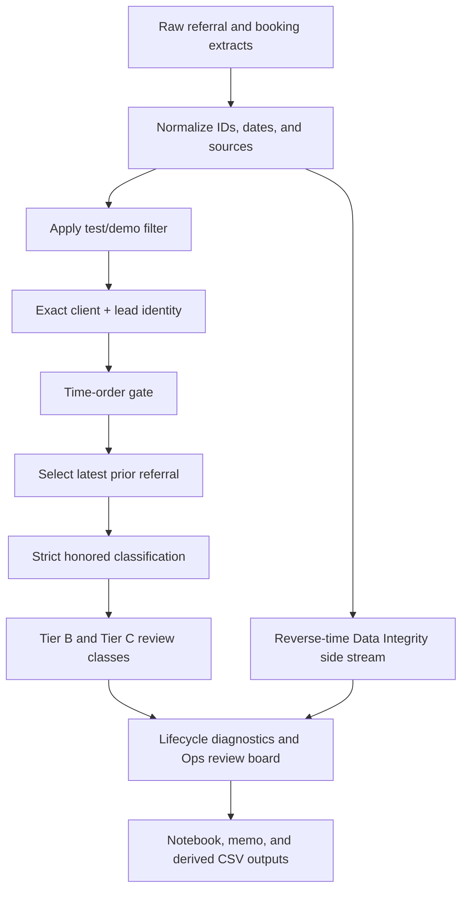

# Referral Attribution System

This repository turns the accepted referral-bypass analysis into a small, reproducible internal analytics system. It normalizes two extracts, applies documented attribution rules, produces an operational review queue, and validates that the accepted results do not drift.

## Business Purpose

The system answers three separate questions:

1. Which bookings have a valid prior referral and were strictly recorded as `REFERRAL`?
2. Which bookings require manual attribution review?
3. Which records are data-integrity or identity-confirmation issues rather than primary bypass evidence?

The outputs are review evidence. They do not prove fraud, commission eligibility, commission loss, or payout status.

## Repository Structure

```text
.
├── config/
│   └── attribution_rules.json
├── src/referral_attribution/
│   ├── cleaning.py
│   ├── classification.py
│   ├── config.py
│   ├── funnel.py
│   ├── io.py
│   ├── matching.py
│   ├── pipeline.py
│   ├── quality.py
│   └── run_tracking.py
├── tests/
├── code/
│   └── 5.1_lifecycle_and_decision.ipynb
├── data/
│   ├── raw/
│   └── derived/
├── log/
│   ├── metric_dictionary.md
│   ├── decision_memo.md
│   └── changeLog.md
├── pyproject.toml
├── README.md
└── requirements.txt
```

Historical notebooks, internal plans, run evidence, and superseded reports are
stored outside the active repository in the local `Terra Softech_2_append`
archive. The Python package is the only source of current attribution logic.

## Environment Setup

```bash
python3 -m venv .venv
source .venv/bin/activate
python3 -m pip install -e ".[dev]"
```


## Run the Pipeline

From the repository root:

```bash
python3 -m referral_attribution.pipeline
```

The installed console command is equivalent:

```bash
referral-attribution
```

Internal path discovery is portable and does not use personal absolute paths.

Optional local run evidence:

```bash
python3 -m referral_attribution.pipeline \
  --config config/attribution_rules.json \
  --track-run \
  --run-id week5_review
```

This creates local inventory, event, checkpoint, and summary files under
`runs/week5_review/`. It records file metadata and regression values only; it
does not copy row-level source data. `runs/` is ignored by Git.

## Run the Tests

```bash
python3 -m pytest
```

Optional local JUnit evidence:

```bash
python3 -m pytest --junitxml=reports/junit.xml
```

## Execute the Week 5 Notebook

```bash
python3 -m jupyter nbconvert \
  --to notebook --execute --inplace \
  code/5.1_lifecycle_and_decision.ipynb \
  --ExecutePreprocessor.timeout=300
```

## Execution Flow



## Primary Analytical Definitions

- **Identity:** exact `client + lead_id`.
- **Time gate:** referral on or before `bookingDate`; fallback to `booking_created_on`.
- **Selection:** latest eligible prior referral.
- **Strict honored:** `booking_source == "REFERRAL"`.
- **Reverse time:** Data Integrity only; never bypass evidence.
- **Tier B:** primary review with multiple-referrer or timeline ambiguity.
- **Tier C:** exact encrypted-identity route requiring identity confirmation.
- **Agreement value:** transaction context only.

See [`log/metric_dictionary.md`](log/metric_dictionary.md) for complete recomputation rules.

## Generated Outputs

The pipeline writes to `data/derived/`:

- `data_quality_summary.csv`
- `filter_base_summary.csv`
- `filter_impact_summary.csv`
- `same_enquiry_time_quality_summary.csv`
- `reverse_time_data_integrity_cases.csv`
- `attribution_window_sensitivity.csv`
- `lifecycle_funnel_summary.csv`
- `same_vs_cross_project_summary.csv`
- `booking_source_summary.csv`
- `multi_referrer_summary.csv`
- `ops_review_board.csv`

`attribution_window_sensitivity.csv` is the Week 5 decision table for the
filtered cohort and uses the strict booking-source definition at every window.
`filter_base_summary.csv` and `filter_impact_summary.csv` preserve the
before/after test-demo-filter audit required for the primary funnel.

## Automation Boundary

- Local CLI, tests, notebook execution, and optional run evidence are supported.
- No GitHub Actions artifact upload is included because raw and review-level
  files must not be sent to external services without explicit data approval.
- `classification.py` remains the case-rule module; it is intentionally not
  renamed to `scoring.py` because the system uses evidence classes, not a
  numeric risk or fraud score.
- `requirements.txt` remains as a simple compatibility list, while
  `pyproject.toml` provides editable installation and the console command.

## How Ops Should Use the Review Board

Open `data/derived/ops_review_board.csv` and sort by `priority_order`:

1. **P0:** validate reverse-time timestamps and source disagreements.
2. **P1:** verify attribution and ownership for the four primary Tier B bookings.
3. **P2:** confirm identity for Tier C before considering attribution.

Do not add P0 or P2 rows to the primary review count.

## Known Limitations

- No approved maximum attribution window exists.
- The test/demo filter is name-based.
- Exact encrypted mobile/email equality does not prove identity.
- Multiple prior referrers require source-system review.
- The extracts do not contain commission policy, rate, reversal, or payout data.
