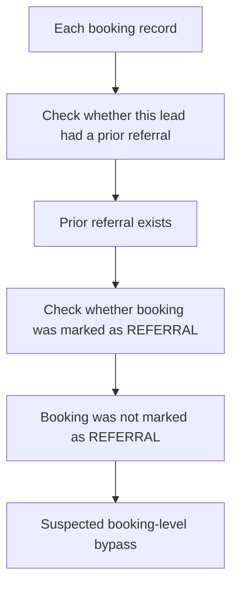
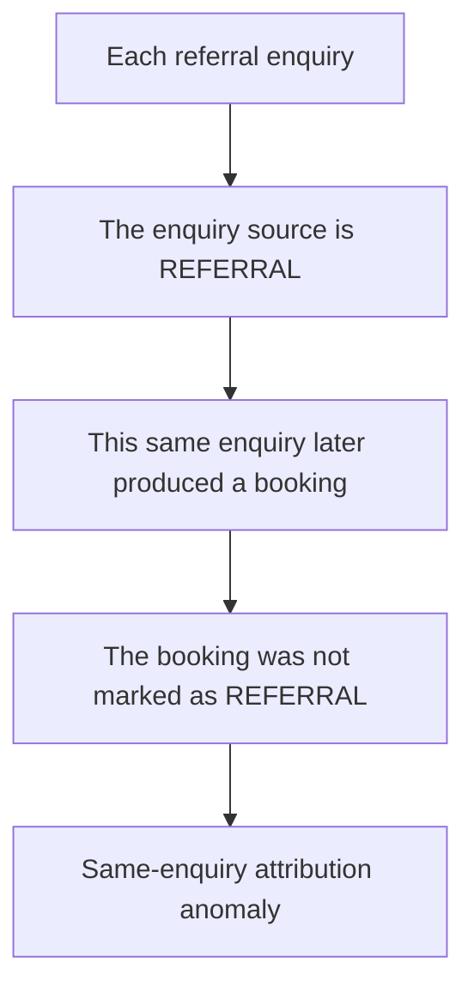

# Referral Bypass Review Log

## 1. Core Question

The main question is:

> Has a customer submitted a referral, and was that referral honored when the referred lead later booked?

In business terms, referral bypass means:

> A referrer submitted a referral. The referred lead later purchased or booked. That booking should normally be marked as `REFERRAL`, so the referrer can receive commission. If the booking is instead recorded as a non-referral booking, the commission may be bypassed.

## 2. Current Matching Rule

- Match records by exact `lead_id`.
- A referral is eligible only if `referral_submitted_on <= bookingDate`.
- If one booking has multiple prior referrals, match it to the latest referral before that booking.
- A booking is honored when either `booking_source` or `enquiry_source` is marked as `REFERRAL`.
- A booking is flagged when it has an eligible prior referral but is not honored as `REFERRAL`.

## 3. Route 1: Booking-Level Bypass Check

This route starts from final booking records and looks backward.



This route answers:

> Did this final booking have a prior referral, but the booking itself was not recorded as a referral?

Result:

```text
5,275 booking records
↓
20 bookings had an eligible prior referral
↓
16 were correctly marked as REFERRAL
↓
4 were not marked as REFERRAL
```

So the first review list contains:

> 4 high-confidence suspected booking-level bypass cases.

This is the closest match to the commission-saving scenario.

## 4. Route 2: Same-Enquiry Attribution Check

This route starts from referral enquiry records and checks the referral enquiry itself.



This route answers:

> Did this referral enquiry itself produce a booking, but the system did not honor it as a referral?

Result:

```text
28 same-enquiry attribution anomalies
↓
7 affected leads
```

This is more like an attribution-quality review list. It is not the same as the booking-level bypass list.

## 5. Why the Two Numbers Are Different

The `4` cases and the `28` anomalies are produced by two different routes.

### Why the booking-level number is smaller

The booking-level check is stricter:

- same `lead_id`;
- referral time is before the booking time;
- only the latest prior referral is used;
- final booking is not marked as `REFERRAL`.

This makes the booking-level list conservative.

### Why the same-enquiry number is larger

The same-enquiry check starts from referral enquiries. If the referral enquiry itself produced a booking but was not honored, it is counted as an anomaly.

One lead can have multiple referral enquiry records, so `28` anomaly rows only involve `7` leads.

## 6. Overlap Check

The two result sets overlap only at the lead level.

| Check | Result |
|---|---:|
| Booking-level suspected bypass cases | 4 |
| Same-enquiry attribution anomalies | 28 |
| Same-enquiry anomaly leads | 7 |
| Overlapping leads | 1 |
| Overlapping lead ID | 887 |
| Overlapping referral enquiry IDs | 0 |
| Strict booking/enquiry ID overlap | 0 |

How to read this:

- The two lists are related, but they are not the same records.
- They should not be added as `32` independent customer-level issues.
- The safest review order is:
  1. review the 4 booking-level suspected bypass cases first;
  2. then review the 28 same-enquiry attribution anomalies as a separate attribution-quality list.

## 7. Files for Review

- `suspected_bypass_cases.csv`: 4 booking-level suspected bypass cases.
- `same_enquiry_attribution_anomalies.csv`: 28 same-enquiry attribution anomalies.
- `overlap_summary.csv`: overlap summary between the two diagnostic views.
- `overlap_by_lead.csv`: lead-level overlap result.
- `compact_review_table.csv`: compact booking-level review table.
